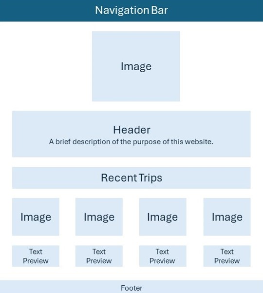
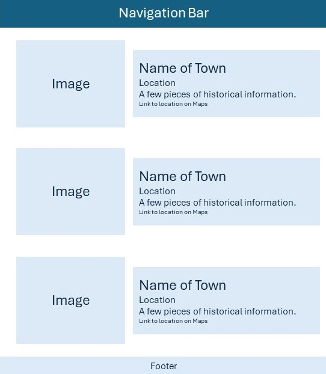
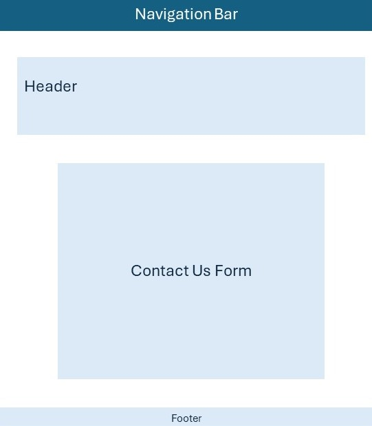

# Sara Chauvette's INFO 6420 Project

This will be a website about ghost towns in the Michigan. 

## Wireframes

Here are some wireframes to show potential layouts for the site. 

Homepage:

Header - Trips to Michigan Ghost Towns

Navigation Menu - will include links to the homepage pages for each region of the Upper Peninsula and a contact form

Main Content - will include a photo and a short description of the purpose of this website

Recent Trips - will include previews of four recent towns we've visited

Footer - will include copyright information

Region Page:

Header - Ghost Towns of the Northern Upper Peninsula

Navigation Menu - will include links to the homepage pages for each region of the Upper Peninsula and a contact form

Main Content - will consist of images of the ghost town with a brief description, the location, and a link to Google Maps

Footer - will include copyright information

Contact Page:

Header - Contact Us

Navigation menu - will include links to the homepage pages for each region of the Upper Peninsula and a contact form

Main Content - A contact form

Footer - will include copyright information